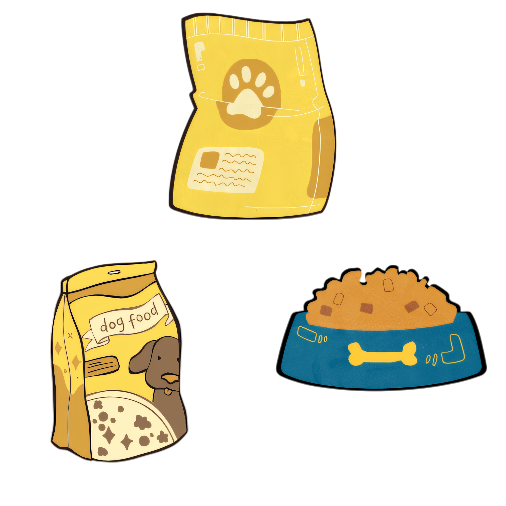
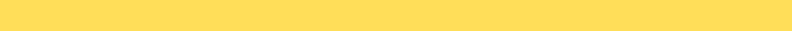


<!-- Logotipo -->

  
  
  

<!-- ------------------ -->

<!-- Descrição -->
 ## 📝🦴 Descrição

🐶 🐱 **MiauMigo** é um e-commerce do setor pet que conecta empresas e consumidores, impulsionando negócios e apoiando ONGs de resgate animal por meio da destinação de parte dos lucros. 🐾✨

<!-- ------------------ -->

<!-- Estrutura do Site -->
## 🔍 **Estrutura do Site**  

🚧🛠️ **Em desenvolvimento...** 🐾  

<!-- ------------------ -->

<!-- Objetivo -->

## 🎯 **Objetivo**  

Facilitar a transição digital de micro, pequenas e médias empresas (MPEs) do setor pet, fortalecendo a conexão entre empresas e consumidores, impulsionando o crescimento sustentável desse mercado e apoiando ONGs de resgate animal por meio da destinação de parte dos lucros. 🐕📱🐈  

<!-- ------------------ -->

<!-- Diferenciais -->

## 🦔 🦎 **Diferenciais**:

🚧🛠️ **Em desenvolvimento...** 🐾 

🐾💙🛒 O **Miguamigo Shop** é mais do que um e-commerce pet; é uma ponte entre empresas e consumidores, incentivando a transformação digital e apoiando a causa animal para um futuro mais conectado e solidário.

<!-- ------------------ -->

<!-- Como usar -->
## 🐶 Como Usar

🚧🛠️ **Em desenvolvimento...** 🐾 

<!-- ------------------ -->

<!-- Demo -->

## 🌐 Demo  

🚧🛠️ **Em desenvolvimento...** 🐾 

<!-- ------------------ -->

<!-- Tela de Demonstração -->

## 📊 Tela de Demonstração

  
Aqui estão alguns protótipos de tela do **MiauMigo Shop**:

- **Página Home**:

<!-- ------------------ -->

<!-- Tecnologias Utilizadas -->

## 🖥️ Tecnologias Utilizadas

🚧🛠️ **Em desenvolvimento...** 🐾 

<!-- ------------------ -->

<!-- integrantes -->

## 👥🦴 Integrantes

<table>
  <tr>
  <td align="center">
       
      <strong>Kaique Gonçalves</strong> 
      
      
    </td>
    <td align="center">
       
      <strong>Lucas Peixoto</strong> 
      
      
    </td>
    <td align="center">
       
      <strong>Pedro Henrique</strong> 
      
      
    </td>
    <td align="center">
       
      <strong>Samuel Rodrigues</strong> 
      
      
    </td>
    <td align="center">
       
      <strong>Victor Augusto</strong> 
      
      
    </td>
    <!-- alterar links -->
     </td><td align="center">
       
      <strong>Caio Vitor</strong> 
      
      
    </td>
    <td align="center">
       
      <strong>Augusto Evangelista</strong> 
      
      
  </tr>
</table>

