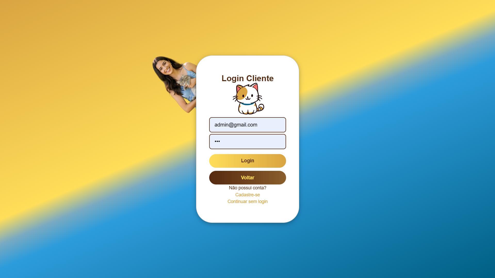

<!-- Logotipo -->

  
  
  

<!-- ------------------ -->

<!-- Descrição -->
 ## 📝🦴 Descrição

🐶🐱 MiauMigo é um e-commerce inovador voltado ao universo pet, que conecta empresas do setor a consumidores apaixonados por seus animais. Além de impulsionar negócios, o projeto tem um propósito social: parte dos lucros é destinada ao apoio de ONGs que resgatam e cuidam de animais em situação de vulnerabilidade. 🐾💛
Com MiauMigo, cada compra vai além do carinho — é também um gesto de amor e solidariedade. ✨

<h2>📑 Índice</h2>

|  |  |
|----------|-----------|
| [🦴 Descrição](#-🦴-descrição) | [👥 Integrantes](#-🦴-integrantes) | 
| [🎯 Objetivo](#-objetivo) | [🌟 Diferenciais](#-🦔-🦎-diferenciais) |
| [🛠️ Como Usar](#-como-usar) | [🎥 Demo](#-demo) |
| [🖼️ Tela de Demonstração](#-tela-de-demonstracão) | [🧪 Tecnologias Utilizadas](#-tecnologias-utilizadas) |
|

## 🎯 **Objetivo**  

Facilitar a transição digital de micro, pequenas e médias empresas (MPEs) 🏪🐾 do setor pet 🐶🐱, fortalecendo a conexão 💬🤝 entre empresas e consumidores 🛍️❤️ por meio de uma plataforma acessível e eficiente 📱💻.
A proposta busca impulsionar o crescimento sustentável 🌱📈 desse mercado, ao mesmo tempo em que promove o impacto social 🌍🐕‍🦺, destinando parte dos lucros 💸💛 ao apoio de ONGs que resgatam e cuidam de animais em situação de vulnerabilidade 🐾🏠✨.

## 🦔 🦎 **Diferenciais**:

🐾💙🛒 MiauMigo Shop é mais do que um simples e-commerce pet...
 é mais do que um simples e-commerce pet — é uma ponte entre empresas 🏪 e consumidores 🐶👩‍💻, promovendo a transformação digital 📲 e fortalecendo o mercado pet com empatia e inovação.
O grande diferencial? Parte dos lucros 💰 é destinada ao apoio de ONGs de resgate animal 🐕‍🦺🏠, unindo propósito, tecnologia e solidariedade para construir um futuro mais conectado e humano. 🌐💞🐾

## 🌐 Demo  

🚀 Quer ver o projeto funcionando? Acesse aqui:

🔗 [👉 Clique aqui para visualizar o site](https://miau-migo-web.vercel.app/home)

>⚠️ **Atenção:** O site ainda está em processo de adaptação para dispositivos móveis.📱Recomendamos o uso em um <strong>computador</strong> 💻 para melhor experiência de navegação!

<h2 align="center">📊 Tela de Demonstração</h2>

<table style="border-spacing: 8px; width: 100%;">
  <tr>
    <th style="text-align: center; vertical-align: top; padding-bottom: 8px;">🏠 Home</th>
    <th style="text-align: center; vertical-align: top; padding-bottom: 8px;">🔐 Login</th>
    <th style="text-align: center; vertical-align: top; padding-bottom: 8px;">🛒 Produtos</th>
  </tr>
  <tr>
    <td style="vertical-align: top; padding: 0;">
      
      
      
      
    </td>
    <td style="vertical-align: top; padding: 0 8px;">
      
Login geral

      
      
Login para cliente

      
      
Login para vendedor

      
    </td>
    <td style="vertical-align: top; padding: 0;">
      
Tela dos produtos

      
      
Detalhes do produto

      
      
Tela de perfil do vendedor

      
    </td>
  </tr>
</table>

<!-- ------------------ -->

<!-- Tecnologias Utilizadas -->

## 🖥️ Tecnologias Utilizadas

 

 

<!-- ------------------ -->

<!-- integrantes -->

## 👥🦴 Integrantes

<table>
  <tr>
  <td align="center">
       
      <strong>Kaique Gonçalves</strong> 
      
      
    </td>
    <td align="center">
       
      <strong>Lucas Peixoto</strong> 
      
      
    </td>
    <td align="center">
       
      <strong>Pedro Henrique</strong> 
      
      
    </td>
    <td align="center">
       
      <strong>Samuel Rodrigues</strong> 
      
      
    </td>
    <td align="center">
       
      <strong>Victor Augusto</strong> 
      
      
    </td>
    <!-- alterar links -->
     </td><td align="center">
       
      <strong>Caio Vitor</strong> 
      
      
    </td>
    <td align="center">
       
      <strong>Augusto Evangelista</strong> 
      
      
  </tr>
</table>

